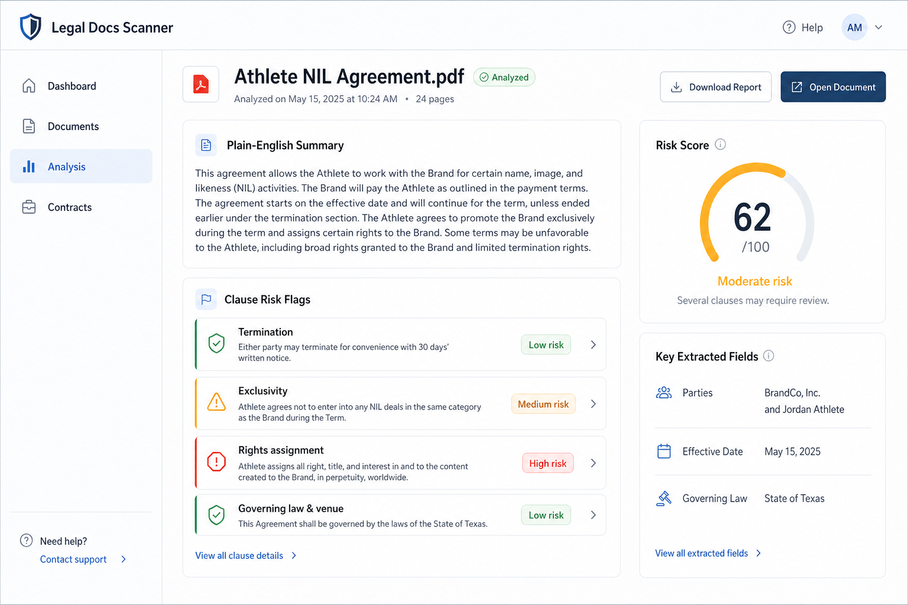

# Legal Docs Scanner

**AI-powered extraction of key information from legal documents**

Portfolio project by **Muhammad Muazzain** — originally delivered as a private engagement for a legal-tech client that needed reliable NLP/ML pipelines for contract and agreement intelligence. Shared here as a demonstration of end-to-end AI engineering for legal document understanding.

[](https://github.com/MuhammadMuazzain)
[](#technology-stack)
[](./LICENSE)

## Interface preview



*Concept UI showing the analysis results view: document upload context, plain-English summary, clause-level risk flags, and key extracted fields.*

---

## Overview

Legal Docs Scanner is a full-stack platform for **designing, training, and operating AI models** that extract structured information from legal documents. It combines:

- **Natural language processing** for clause detection, entity extraction, and document Q&A
- **Machine learning / fine-tuning** on labeled legal corpora (CUAD-aligned clause categories)
- **Domain understanding of legal terminology** across commercial contracts and related instruments
- **Accuracy and compliance-minded workflows**, including human review of model outputs

The system helps legal teams move from raw PDFs/text to structured fields: parties, dates, obligations, termination terms, governing law, risk signals, and more.

## What It Demonstrates

| Capability | How it shows up in this project |
|---|---|
| Key information extraction | Clause/entity extraction pipelines + structured analysis UI |
| NLP & ML model work | Fine-tuning notebook, LangChain orchestration, generative AI integrations |
| Legal terminology | CUAD-based clause taxonomy (41+ categories) and legal-aware prompts |
| Accuracy & compliance | Confidence-oriented review UX, secure auth, audit-friendly document flows |
| Collaboration with legal workflows | Document chat, dashboards, and exportable analysis for expert review |

## Features

### Core extraction & analysis
- Upload PDF or text legal documents
- Automated clause identification and categorization
- Risk signals and plain-language summaries
- Interactive document Q&A grounded in source text

### AI / ML
- Fine-tuned instruction models for legal contract understanding
- Training workflow on the **Contract Understanding Atticus Dataset (CUAD)**
- LangChain-based orchestration and Google Generative AI integrations

### Product surface
- Next.js web app with auth (Clerk), real-time backend (Convex)
- Dashboard analytics, contract drafting helpers, and document management
- Dark/light themes and responsive UI

## Architecture

```
┌─────────────────┐    ┌─────────────────┐    ┌─────────────────┐
│   Web Frontend  │    │   AI Processing │    │   Data Storage  │
│   (Next.js 15)  │◄──►│   (Python/ML)   │◄──►│   (Convex DB)   │
└─────────────────┘    └─────────────────┘    └─────────────────┘
         │                       │                       │
         ▼                       ▼                       ▼
┌─────────────────┐    ┌─────────────────┐    ┌─────────────────┐
│  Authentication │    │  Model Training │    │ Document Store  │
│     (Clerk)     │    │   (Jupyter)     │    │    (Files)      │
└─────────────────┘    └─────────────────┘    └─────────────────┘
```

## Project Structure

```
legal-docs-scanner/
├── ai-model/                 # ML training & dataset tooling
│   ├── Fine_tuning_code.ipynb
│   └── data-set/             # CUAD-oriented training resources
├── apps/
│   ├── web/                  # Main Next.js application
│   └── admin/                # Admin app scaffold
├── CONTRIBUTORS.md
├── LICENSE
└── README.md
```

## Getting Started

### Prerequisites
- Node.js 18+
- Python 3.8+ (for model training notebooks)
- npm or yarn
- API keys for Clerk, Convex, and Google Generative AI

### Install & run the web app

```bash
git clone https://github.com/MuhammadMuazzain/Legal-Docs-Scanner.git
cd Legal-Docs-Scanner/apps/web
npm install
```

Create `apps/web/.env.local`:

```env
NEXT_PUBLIC_CLERK_PUBLISHABLE_KEY=your_clerk_publishable_key
CLERK_SECRET_KEY=your_clerk_secret_key
NEXT_PUBLIC_CONVEX_URL=your_convex_url
GOOGLE_GENERATIVE_AI_API_KEY=your_google_ai_key
```

```bash
npm run dev
```

Open [http://localhost:3000](http://localhost:3000).

### Model training (optional)

```bash
cd ai-model
jupyter notebook Fine_tuning_code.ipynb
```

Follow the notebook for data prep, LLaMA-style instruction fine-tuning, evaluation, and export. Download the CUAD dataset locally into `ai-model/data-set/` (see that folder’s README); large corpus files are not committed.

## Usage Flow

1. Sign in and upload a legal PDF/text document
2. Run AI analysis to extract clauses and key fields
3. Review structured results and risk signals
4. Ask follow-up questions via document chat
5. Export or persist analysis for legal review

## Technology Stack

**Frontend:** Next.js 15, React 19, TypeScript, Tailwind CSS, Radix UI  
**Backend:** Convex, Clerk, SVIX  
**AI/ML:** LangChain, Google Generative AI, Python, Jupyter, CUAD-oriented fine-tuning  
**Docs/UI utils:** react-pdf, pdf-parse, Zustand, Recharts, Sonner

## API Surface (application routes)

- Contract upload & analysis endpoints under the web app API layer
- Clause extraction / classification actions via AI services
- Authenticated document history and dashboard analytics

Exact route names live under `apps/web` (Next.js + Convex actions).

## Author & Contributor

| Role | Name | Contact |
|---|---|---|
| Author / Sole contributor | **Muhammad Muazzain** | [muhammadmuazzain07@gmail.com](mailto:muhammadmuazzain07@gmail.com) |

- GitHub: [github.com/MuhammadMuazzain](https://github.com/MuhammadMuazzain)
- Repository: [Legal-Docs-Scanner](https://github.com/MuhammadMuazzain/Legal-Docs-Scanner)

See [CONTRIBUTORS.md](./CONTRIBUTORS.md).

## Acknowledgments

- **The Atticus Project** — CUAD dataset for contract understanding research
- Next.js, Clerk, Convex, LangChain, and the open-source ML ecosystem

## License

MIT License — see [LICENSE](./LICENSE).

---

Built by **Muhammad Muazzain** · AI engineering for legal document intelligence
